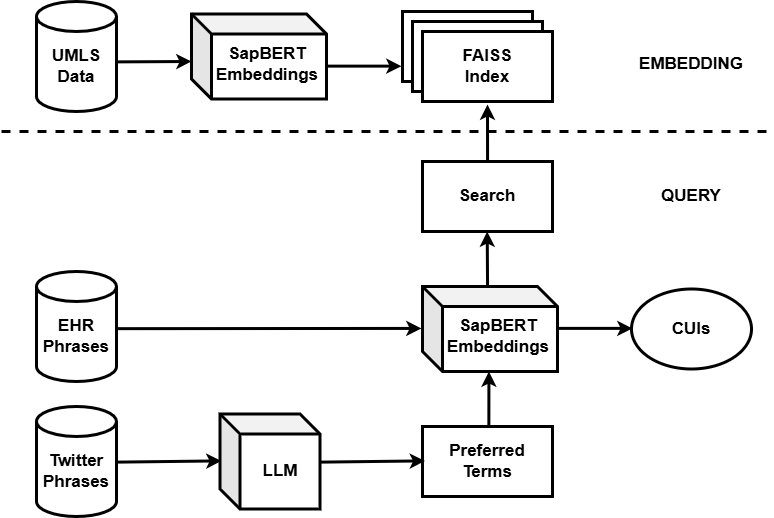
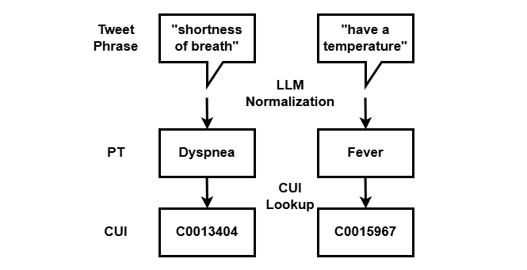

# Biomedical Concept Normalization

## Overview

Biomedical concept normalization is the task of mapping clinical and patient-generated health expressions to standardized biomedical concepts.

This project combines Large Language Models (LLMs), SapBERT embeddings, FAISS vector search, and the UMLS Metathesaurus to normalize symptom expressions and retrieve the corresponding UMLS Concept Unique Identifier (CUI).

The framework was evaluated on both clinical and social media symptom expressions and supports multiple state-of-the-art LLMs.

---

## Publication

This project is based on our peer-reviewed research article:

**Normalizing Health Concepts with Biomedical Embedding and LLMs**

Published in *HeaLing @ EACL* (2026)

Paper: https://aclanthology.org/2026.healing-1.15/

### Citation

Azam, I., Jiang, K., & Bernard, G. (2026, March). Normalizing Health Concepts with Biomedical Embedding and LLMs. In Proceedings of the 1st Workshop on Linguistic Analysis for Health (HeaLing 2026) (pp. 180-190).

---

## Features

* Biomedical concept normalization
* UMLS concept retrieval
* SapBERT semantic embeddings
* FAISS vector similarity search
* Clinical and social media text normalization
* GPU-accelerated embedding generation
* Support for OpenAI, Gemini, and Llama models
* Unified normalization and retrieval pipeline

---

## System Architecture



---

## Dataset

The framework used:

- UMLS Metathesaurus 2025AA
- 3,144 clinical sign and symptom expressions extracted from electronic health records (EHRs)
- 102 social media symptom expressions collected from COVID-19 related tweets

The UMLS knowledge base contains over **3.59 million English biomedical terms**, which were embedded using SapBERT and indexed using FAISS for semantic retrieval.

---

## Key Results

### CUI Retrieval Performance

| Method             | Clinical Accuracy | Social Media Accuracy |
| ------------------ | ----------------- | --------------------- |
| Exact String Match | 0.679             | 0.235                 |
| MetaMap Lite       | 0.579             | 0.118                 |
| Proposed Framework | **0.858**         | **0.980**             |

### Model Comparison for Preferred Term Generation

| Model            | Accuracy  | F1 Score  |
| ---------------- | --------- | --------- |
| GPT-4o Mini      | **0.980** | **0.990** |
| GPT-4o           | 0.961     | 0.980     |
| Gemini 2.0 Flash | 0.961     | 0.980     |
| GPT-5            | 0.941     | 0.970     |
| Llama 3.3 70B    | 0.941     | 0.970     |
| Llama 3.1 70B    | 0.921     | 0.959     |
| Gemini 2.5 Flash | 0.882     | 0.937     |

### Sample Output



---

## Technologies Used

### Large Language Models

* GPT-4o
* GPT-4o Mini
* GPT-5
* Gemini 2.0 Flash
* Gemini 2.5 Flash
* Llama 3.1 70B
* Llama 3.3 70B

### Biomedical NLP

* UMLS Metathesaurus
* SapBERT

### Retrieval

* FAISS

### Python Libraries

* PyTorch
* Transformers
* Pandas
* NumPy
* FAISS
* Requests
* Python Dotenv

---

## Hardware Notes

* SapBERT embedding generation supports GPU acceleration through PyTorch CUDA.
* FAISS indexing benefits from GPU-enabled environments when processing large UMLS datasets.
* Llama 3.1 70B and Llama 3.3 70B were evaluated locally using Ollama.
* OpenAI and Gemini models were accessed through their respective APIs.

---

## Project Structure

```text
Biomedical-Concept-Normalization/
│
├── src/
│   ├── config.py
│   ├── sapbert_encoder.py
│   ├── build_umls_index.py
│   ├── faiss_retriever.py
│   ├── llm_normalizer.py
│   ├── cui_retrieval.py
│   └── run_pipeline.py
│
├── data/
│   └── README.md
│
├── docs/
│   ├── architecture.png
│   └── normalization_examples.png
│
├── requirements.txt
├── .env.example
├── .gitignore
└── README.md
```

---

## Installation

```bash
git clone https://github.com/iramazam3/Biomedical-Concept-Normalization.git

cd Biomedical-Concept-Normalization

pip install -r requirements.txt
```

---

## Environment Variables

Create a `.env` file using `.env.example`:

```env
OPENAI_API_KEY=your_openai_api_key
GOOGLE_API_KEY=your_google_api_key
OLLAMA_URL=http://127.0.0.1:11434/api/generate
```

---

## Running the Pipeline

Select a model inside `run_pipeline.py`.

```python
MODEL_NAME = "gpt-4o"
```

Examples:

```python
MODEL_NAME = "gpt-4o-mini"
MODEL_NAME = "gpt-5"
MODEL_NAME = "gemini-2.0-flash"
MODEL_NAME = "gemini-2.5-flash"
MODEL_NAME = "llama3.1:70b"
MODEL_NAME = "llama3.3:70b"
```

Build the UMLS index:

```bash
python src/build_umls_index.py
```

Run concept normalization:

```bash
python src/run_pipeline.py
```

---

## Author

**Iram Azam**

M.S. Computer Information Technology 

Purdue University
